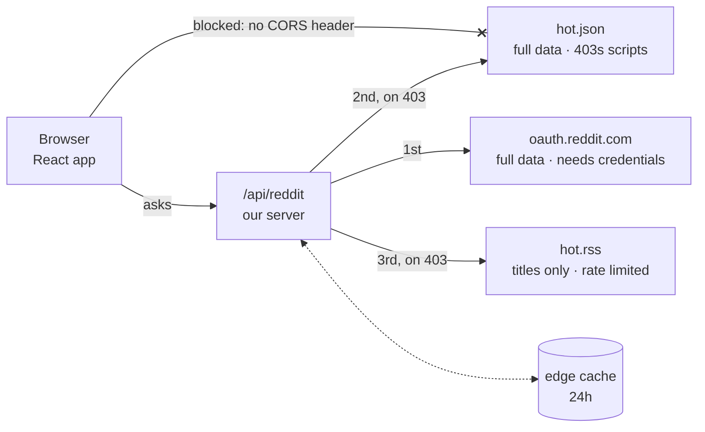

# The 403 Investigation

Every documented way to read a subreddit returned **403 Forbidden**. The obvious
explanation was wrong, and finding that out changed the architecture.

These are the working notes for [The Subreddit Vibe Check](./README.md) — what
was tried, what the evidence showed, and why the code looks the way it does.

---

## Where it started

Two things were broken.

**The first was a plain bug.** The API server returned `{ posts }` but the
frontend read `data.data.children`, so the list was always empty:

```js
// server sent this shape
res.json({ subreddit, count: posts.length, posts });

// frontend read this shape
const fetchedPosts = data?.data?.children || [];   // ← always undefined
```

There is no `data` key on that response, so the expression evaluated to
`undefined?.children` → `undefined` → `[]`. **No error, no crash** — the page
just showed the empty state, as if Reddit had returned nothing.

Optional chaining and `|| []` are there to prevent crashes, and they did their
job perfectly. They also converted a wrong-shape bug into total silence.

The cause: `data.data.children` **is** correct — for Reddit's raw response.
The frontend was written as if it were calling Reddit directly, but it was
calling the server, which had already stripped that wrapper off. Both files
were individually reasonable; they disagreed about who unwraps.

**The second took the rest of the day.** Every request to Reddit came back 403.

---

## The investigation

Each step tested one hypothesis and ruled something out. Step 4 overturned what
steps 1–3 had made everyone believe.

### 1. Is authentication simply required now?

| Endpoint | Result |
| --- | --- |
| `www.reddit.com/r/technology/hot.json` | 403 |
| `old.reddit.com/r/technology/.rss` | 404 |
| `api.reddit.com/r/technology/hot` | 403 |
| `oauth.reddit.com` (no token) | 403 |
| `reddit.com/r/technology/hot.json` | 403 |

Retrying with a full browser `User-Agent` changed nothing.

**Conclusion:** no unauthenticated path survives. OAuth looks mandatory.

### 2. Then use OAuth

Credentials were sitting in `server/.env`, so the fix seemed to be wiring up the
token exchange. Both grant types returned **401**.

Inspecting the credential *shapes* rather than their values gave it away — 14
characters as `xxxx_xxxxxx_xx`, 18 as `xxxx_xxxxxx_xxxxxx`. Those are the exact
character counts of `your_client_id` and `your_client_secret`. The file had
never been filled in.

**Conclusion:** the 401 was a red herring. Still no working path to the data.

### 3. Hypothesis: Reddit blocks datacenter IPs

This is the common explanation and it fit every observation. Reddit throttles
hosting providers to stop scrapers, so requests from a cloud IP get refused
while a home connection is fine.

If true, it had a serious consequence: a serverless function runs from exactly
the IP range that gets blocked, so the deployed app would fail even though local
development worked.

**Prediction if the hypothesis holds:** the same request from a residential
connection returns 200.

### 4. The test that broke the hypothesis

Opening `www.reddit.com/r/technology/hot.json` in a browser on a home connection
returned the real listing. The prediction held.

But running the identical request from Node **on that same machine, on that same
connection** still returned 403 — including with a complete set of Chrome
headers (`Accept-Language`, `sec-ch-ua`, `Sec-Fetch-Mode`, the lot).

| Client | Network | Result |
| --- | --- | --- |
| Browser, logged in | Residential | **200** |
| Node, plain UA | Residential | 403 |
| Node, browser UA | Residential | 403 |
| Node, full Chrome headers | Residential | 403 |

**Conclusion:** same machine, same IP, opposite results. The IP hypothesis is
dead — Reddit discriminates by *client*, not by network.

### 5. So why did the browser succeed?

Two differences remained, and headers weren't one of them:

- **Session cookies.** The browser was logged into Reddit. That request was
  authenticated; Node's was anonymous.
- **TLS fingerprint.** A real Chrome handshake looks nothing like Node's. Reddit
  can tell them apart before a single HTTP header is read — which is why
  spoofing headers achieved nothing.

> **In plain English.** Imagine a club with a doorman. Wearing the right jacket
> isn't enough — the doorman recognises regulars by their face. Changing HTTP
> headers is changing the jacket. Reddit is looking at the face. The browser
> also had a membership card in its pocket: the login cookie.

### 6. Then fetch it from the browser — the app has one

Tempting, and it fails for two independent reasons:

- **No CORS header.** Reddit doesn't send `Access-Control-Allow-Origin` on those
  endpoints, so the browser discards the response before the app sees it.
- **Cookies don't cross origins.** Even without CORS, a cross-origin `fetch()`
  won't carry the user's Reddit session — so it would be an anonymous request,
  which is the kind that gets 403 anyway.

This was built and tested rather than assumed. It failed, and the code was
removed instead of left in as a path that could never succeed.

**Conclusion:** a server-side component isn't a preference here. It's mandatory.

### 7. What Reddit still gives away

If the JSON API refuses scripted clients, does anything else serve them? Reddit
publishes Atom feeds for every subreddit, and those are meant to be read by
machines.

| Request | Result |
| --- | --- |
| `hot.rss`, first call | **200** — 50 entries |
| `hot.rss`, immediately after | 429 — rate limited |

It works, and it rate limits hard. The feed carries titles, authors, links and
timestamps — but no score and no comment count.

**Conclusion:** enough for sentiment analysis, which only needs titles. Not
enough for the full post card. Viable as a fallback with caching, not as the
primary source.

### Epilogue: the API application was declined

An application for Reddit Data API access was submitted and **rejected** under
their Responsible Builder Policy. Tier 1 is therefore unreachable for this
project, and the deployed app runs permanently on tier 3.

---

## The architecture that came out of it



Sentiment analysis runs in the browser on every path.

### The fallback, in code

```js
// Tier 1 if we have credentials, otherwise straight to tier 2.
const response = credentialsReady
  ? await fetchAuthenticated(subreddit, limit)
  : await fetchAnonymous(subreddit, limit);

// Happy path: real data, hand it back and stop.
if (response.ok) {
  const children = (await response.json())?.data?.children || [];

  if (children.length > 0) {
    return { subreddit, posts: normalize(children), mode };
  }
}

// The subreddit doesn't exist. The feed won't have it either,
// so don't waste a request pretending we might recover.
if (response.status === 404) {
  throw new RedditError(404, `r/${subreddit} doesn't exist.`);
}

// A 403 while authenticated is a real answer: the sub is private.
// Falling through here would turn a clear error into a vague one.
if (response.status === 403 && credentialsReady) {
  throw new RedditError(403, `r/${subreddit} is private or quarantined.`);
}

// Everything else: last resort, titles only.
const rssPosts = await fetchViaRss(subreddit, limit);
```

> **In plain English.** Try the best door. If it opens, walk through and stop.
> If the building doesn't exist, say so instead of trying more doors. If we had
> a key and were still refused, the room is genuinely locked — also worth
> saying. Only then go around the back to the window that gives us less.

### Details that matter more than they look

- **A 404 short-circuits.** If a subreddit doesn't exist, the feed won't have it
  either — falling through wastes a request and blurs a clear error.
- **A 403 *with* credentials means something different.** Authenticated, 403
  means the sub really is private. That's a true answer, reported rather than
  papered over.
- **Failures are never cached.** Error responses send `Cache-Control: no-store`
  so a rate limit can't be stored at the edge and replayed to everyone.
- **Degradation is visible.** When tier 3 serves the data, the UI hides score
  and comment count and names the source, rather than showing zeros that look
  like real values.

### Handling the rate limit

Reddit's feed limits per source IP, and each call to `/api/reddit` can be served
by a different serverless instance. **A repeat request is therefore not the same
request again** — it reaches a different IP with its own limit. That makes
retrying effective rather than just polite waiting.

- Client retries up to 4 times, 1.8s apart
- Successful responses cached at the edge: `s-maxage=900`, plus 24h of
  `stale-while-revalidate`
- Stale cached posts are served when a refetch fails — an old listing beats an
  error page

---

## Decisions in the analysis

### Comparative score, not raw score

AFINN sums the sentiment weight of each matched word, so a long title
accumulates a bigger number just by being long. Dividing by word count — the
*comparative* score — makes titles of different lengths comparable.

```js
const result = analyzer.analyze(title, { extras: extraWords });

let label = "neutral";

if (result.comparative > 0.08) {
  label = "positive";
} else if (result.comparative < -0.08) {
  label = "negative";
}
```

| Comparative | Label |
| --- | --- |
| `> 0.08` | 🟢 Positive |
| `-0.08` to `0.08` | ⚪ Neutral |
| `< -0.08` | 🔴 Negative |

> **In plain English.** If one class has 30 children and another has 10, you
> don't decide which is happier by counting smiles — you work out smiles per
> child.

The gap between `-0.08` and `+0.08` is a deliberate dead zone. Without it, one
mildly positive word tips an otherwise factual headline out of neutral.

The same principle governs the overall verdict: positives must beat negatives by
**25%** before the dashboard claims a mood. 30 positive against 25 negative
stays neutral, because with 50 posts that gap is noise.

Scored against real titles:

```
positive     1.000  Amazing breakthrough: open source tool is wonderful and free
negative    -1.571  Company announces massive layoffs after scam lawsuit
neutral      0.000  Reddit adds new API endpoint for developers
negative    -0.889  This app is broken and buggy, total crash fest
```

### A supplementary word list

AFINN was built from general prose and doesn't know how these land on Reddit.
`layoffs`, `outage`, `scam` and `buggy` were added as negative; `wholesome` and
`underrated` as positive.

### Two details from the API docs

- **`raw_json=1`** — without it Reddit escapes `&`, `<` and `>` in titles. Those
  render as `&amp;` and feed junk tokens into the scoring.
- **Filter on `kind === "t3"`** — `t3` is Reddit's type prefix for a link.
  Listings contain other kinds, and only actual posts should be analyzed.

### One relative path, two environments

The frontend calls `/api/reddit` — no host, no port, no environment variable. In
production that path is the serverless function; in development Vite forwards it
to the local server.

```js
server: {
  proxy: {
    "/api": { target: "http://localhost:5000", changeOrigin: true },
  },
},
```

Because the address never changes, there is no "works on my machine" gap and no
CORS configuration to get wrong.

---

## Deployment

One Vercel project serves both halves. The built site is static; anything under
`api/` becomes a serverless function on the same domain.

```
subreddit-vibe-check/
├── api/
│   ├── reddit.js      → becomes /api/reddit
│   └── _reddit.js     shared logic; the _ means "not a route"
├── server/            local dev only, imports the same logic
├── src/               React app + sentiment analysis
└── dist/              build output, served as the site
```

`server/server.js` and `api/reddit.js` both import `api/_reddit.js` — **two
entry points, one implementation.** Separate copies would drift, producing bugs
that only appear in one environment.

---

## Known weaknesses

**AFINN can't read negation or sarcasm.** `"not bad"` scores negative, because
the library sees `bad` (-3) and never sees that `not` reversed it. It matches
words in isolation; it doesn't parse grammar. `"Great, another outage"` scores
positive for the same reason.

A transformer model would classify far better, but the brief asked for a
client-side library, and shipping a model to the browser would cost far more
than the accuracy is worth here.

**Tier 3 rate limits.** Without credentials, subreddits nobody has fetched
recently may fail. The six suggested ones are cached and reliable.

**No tests.** `analyzeTitle` and `summarize` are pure functions and trivially
testable. They should be tested.

---

## The short version

Reddit returned 403 to every documented endpoint. The obvious cause was
datacenter IP blocking, so I tested it directly: same machine, same connection,
browser versus Node. The browser got 200 and Node got 403 — which ruled out the
network entirely and pointed at client fingerprinting and session cookies.

That ruled out fetching from the frontend, so the app proxies through a small
server that tries OAuth first, the public JSON second, and Reddit's Atom feed
last. The feed lacks scores, so the UI hides those fields and says where the
data came from. Sentiment analysis stays in the browser, as specified.
